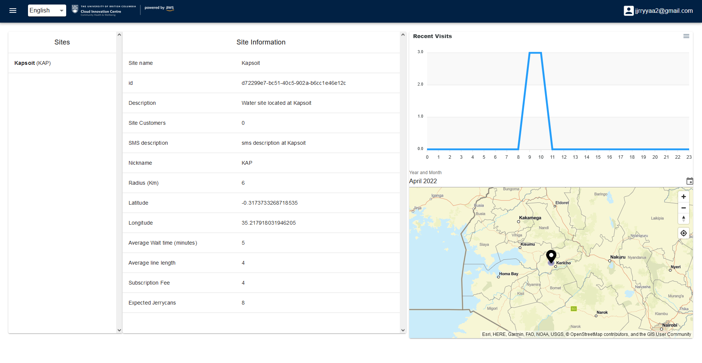
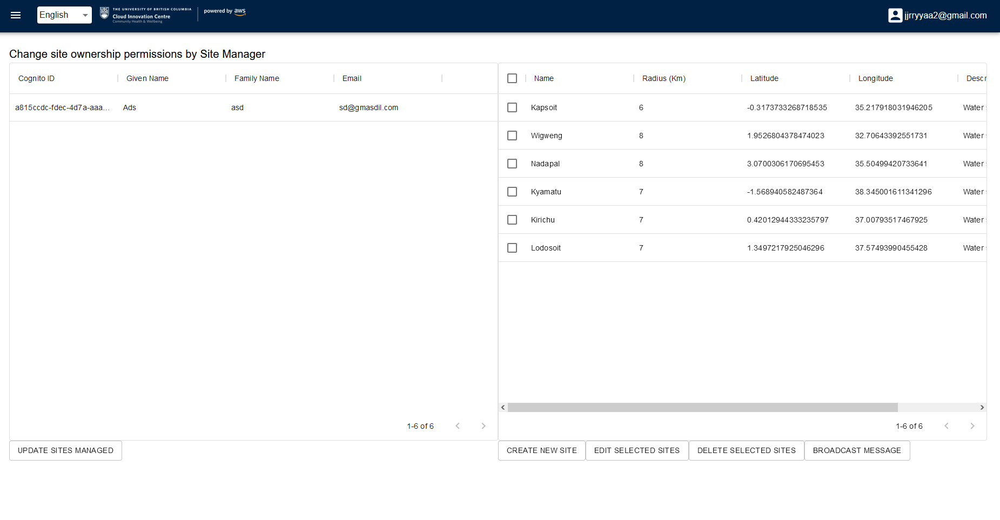

## TapGives Project
We Make Impact is an organization that creates and manages potable water sites in rural Kenya and Uganda, in regions where drinking water is scarce or unsafe. In order to manage the distribution of water to communities in need, TapGives, in collaboration with the UBC Cloud Innovation Centre (CIC), has developed a solution that can easily connect villagers to a nearby water site for a nominal monthly fee, using only a cellular phone and USSD technology (Unstructured Supplementary Service Data).

| Index                             | Description                             |
|:----------------------------------|:----------------------------------------|
| [Demo](#demo)                     | Demonstration of the website            | 
| [Stack Overview](#Stack-Overview) | The technologies behind the project     |
| [Diagram](#Architecture-Diagram)  | How the technologies interact           |
| [Deployment](#Deployment-Guide)   | How to deploy the project               |
| [User Guide](#User-Guide)         | See the motivation behind this project. |
| [Changelog](#Changelog)           | For any changes post publish            |
| [License](#License)               | License details.                        |

# Demo

# Stack Overview

# Architecture Diagram

Refer to handover document for details
# Deployment Guide
To deploy this solution, please follow our [Deployment Guide](docs/DeploymentGuide.md)
# User Guide
For instructions on how to use the web app interface, refer to [Web App User Guide](docs/WebAppUserGuide.md).

On how to use the USSD interface, refer to [USDD Guide](docs).
# Changelog
N/A

# License
This project is distributed under the [MIT License](LICENSE).