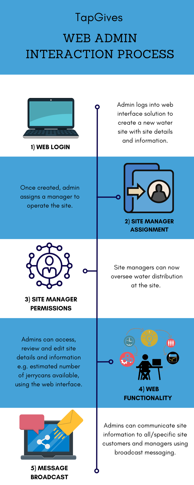
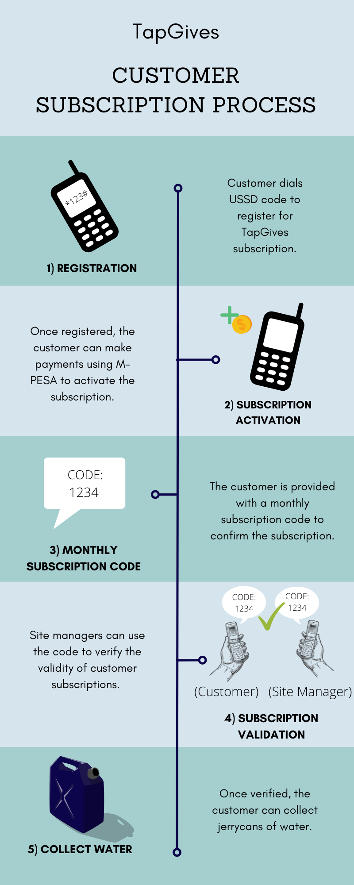
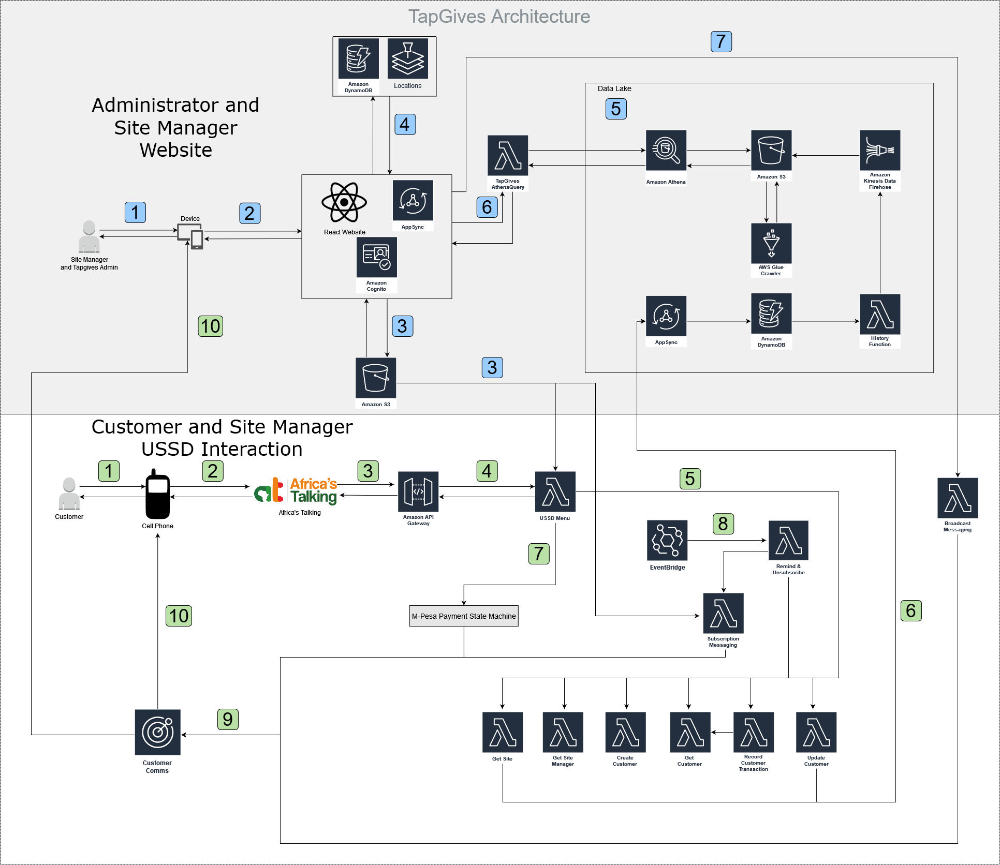

## TapGives Project
We Make Impact is an organization that creates and manages potable water sites in rural Kenya and Uganda, in regions where drinking water is scarce or unsafe. In order to manage the distribution of water to communities in need, TapGives, in collaboration with the UBC Cloud Innovation Centre (CIC), has developed a solution that can easily connect villagers to a nearby water site for a nominal monthly fee, using only a cellular phone and USSD technology (Unstructured Supplementary Service Data).

Web Application             |  USSD Application
:-------------------------:|:-------------------------:
 |

| Index                                                 | Description                                               |
|:------------------------------------------------------|:----------------------------------------------------------| 
| [Stack Overview](#Stack-Overview)                     | The technologies powering the project                     |
| [High Level Architecture](#High-Level-Architecture)   | High level overview illustrating component interactions   |
| [Deployment](#Deployment-Guide)                       | How to deploy the project                                 |
| [User Guides](#User-Guides)                           | The working solution                                      |
| [Changelog](#Changelog)                               | Any changes post publish                                  |
| [License](#License)                                   | License details                                           |

# Stack Overview
The entire solution is divided into two main sections, the [Web Application](./docs/WebAppDeepDive.md) and the [USSD Application](./docs/UssdDeepDive.md). The web application provides filtration site specifications, site manager and customer information, as well as insight into customer visit habits. TapGives administrators can create and update water filtration sites in the system, grant permissions to site managers and update the language localization for both the website and mobile interfaces. The USSD application enables customers to register with the TapGives project, purchase a subscription to a water site, and view important information such as their monthly subscription code and monthly jerrycan balance. In addition, the USSD interaction allows site managers to verify the subscription of a customer and to process customer water collections.  

For more information on the web application, including details on the architecture, see the [Web Application Deep Dive](./docs/WebAppDeepDive.md).  
For more information on the USSD application, including details on the architecture, see the [USSD Application Deep Dive](./docs/UssdDeepDive.md).  

# High Level Architecture

# Deployment Guide
To deploy this solution, please follow our [Deployment Guide](docs/DeploymentGuide.md)

# User Guides
For instructions on how to use the web app interface, refer to [Web App User Guide](docs/WebAppUserGuide.md).  
On how to use the USSD interface, refer to the [USSD User Guide](docs/UssdUserGuide.md).

# Changelog
N/A

# License
This project is distributed under the [MIT License](LICENSE).