# Requirements

Before you launch, you must have the following in place:
- API Gateway Endpoint to the deployed ussd-app project.

# Africa's Talking

Firstly, create an Africa's Talking account:  

Begin by opening the Africa's Talking website, click [here](https://africastalking.com/).  

From here, follow these steps:
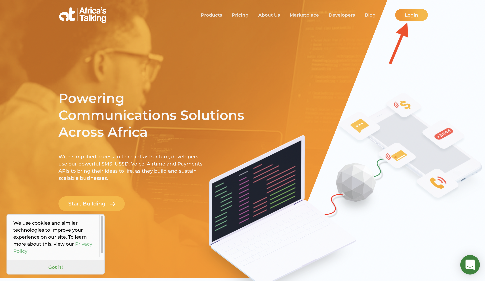
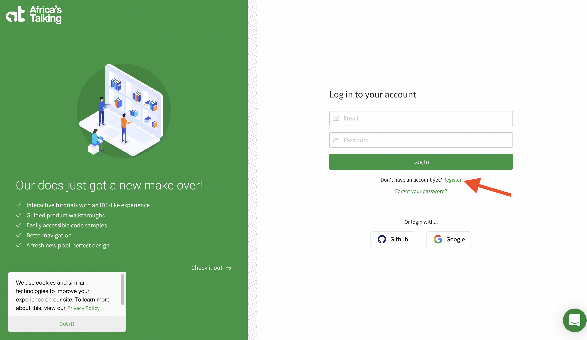
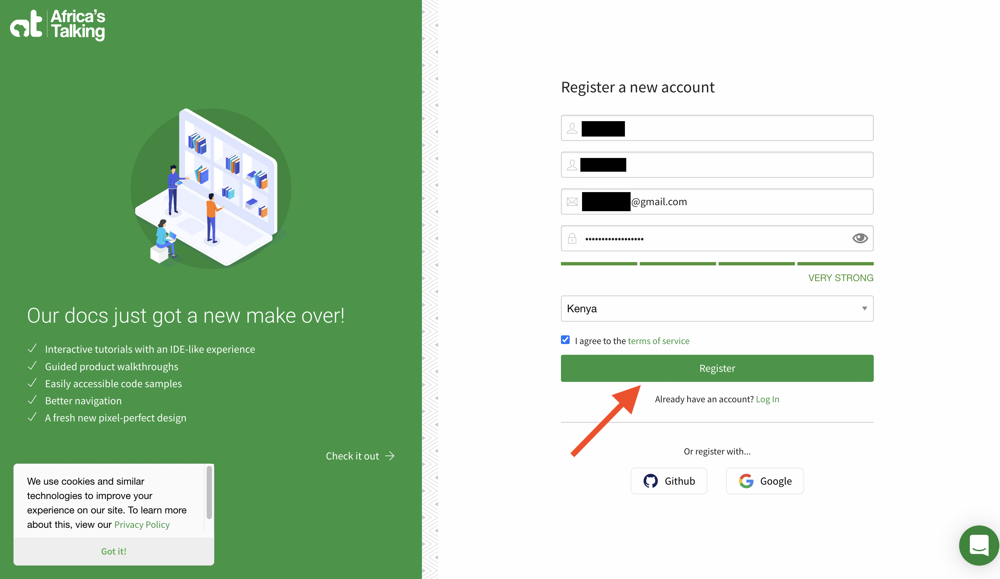
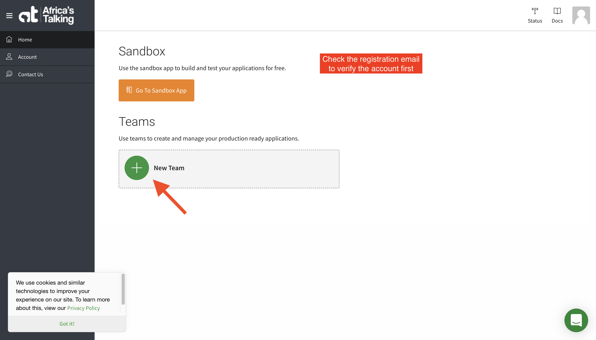
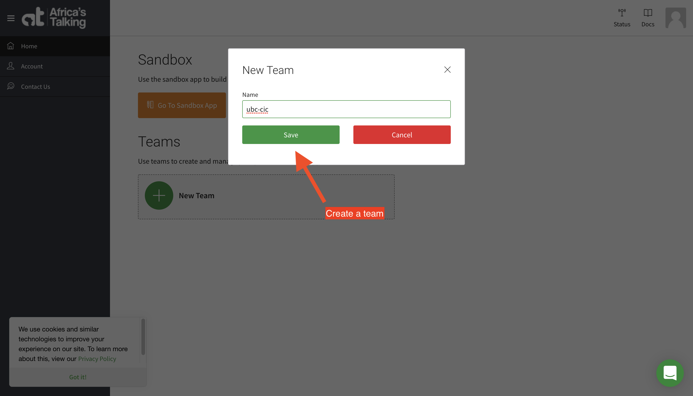
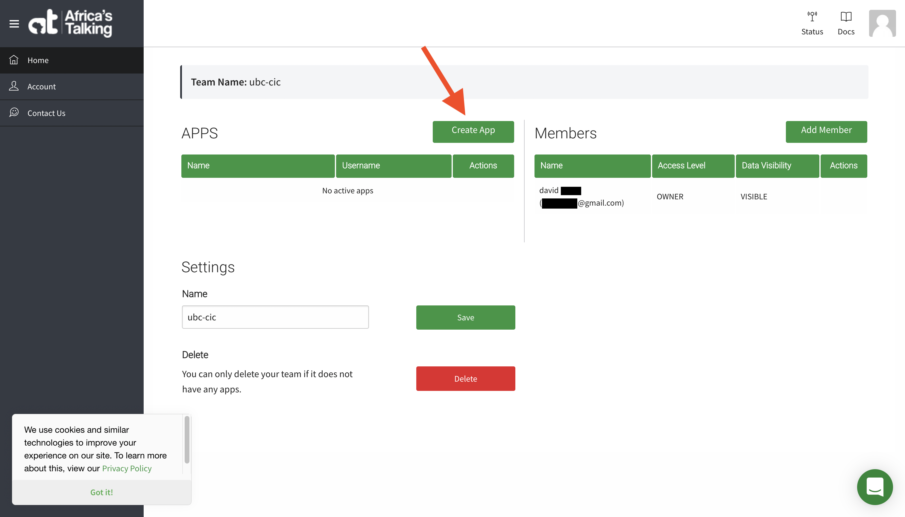
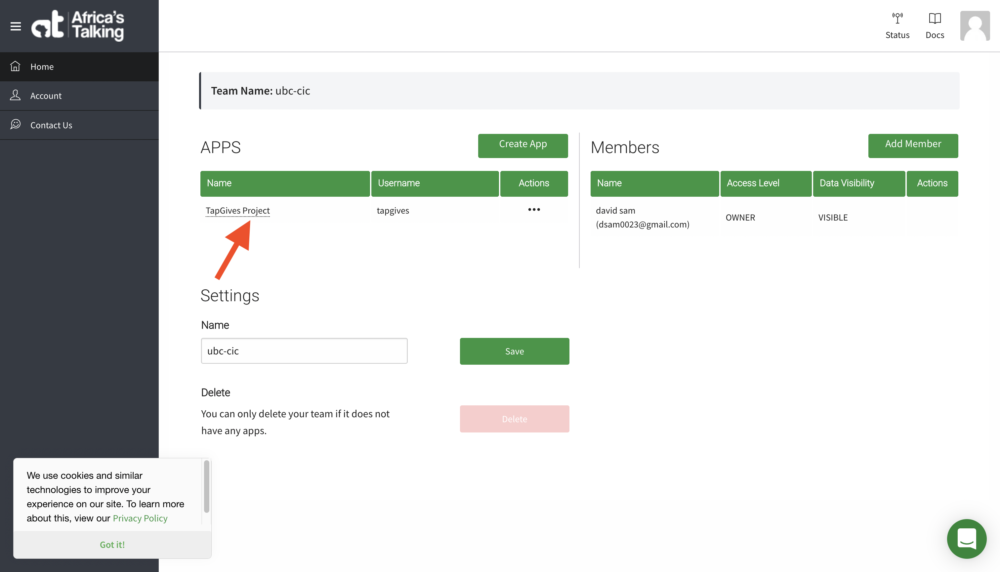
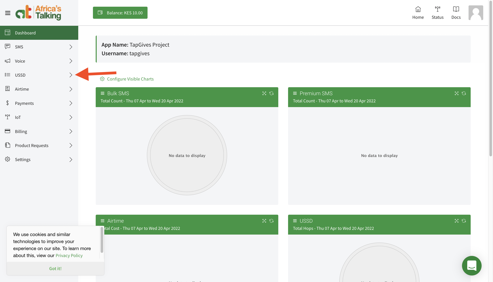
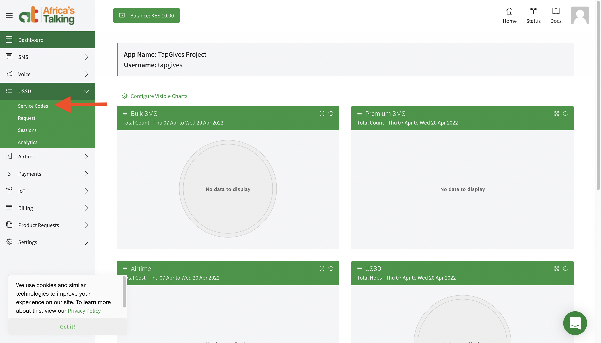
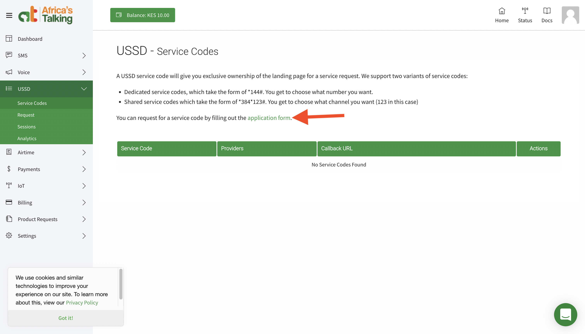
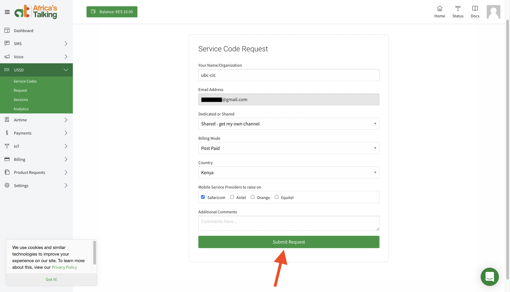
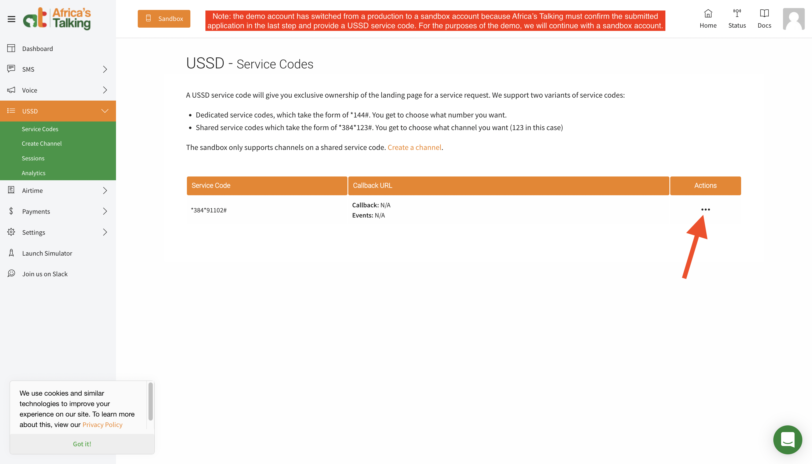
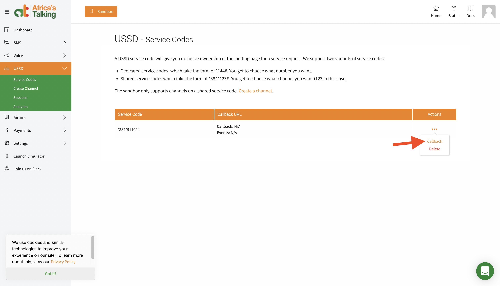
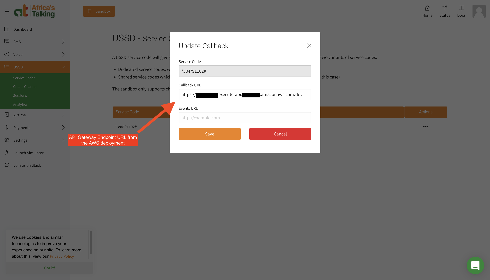
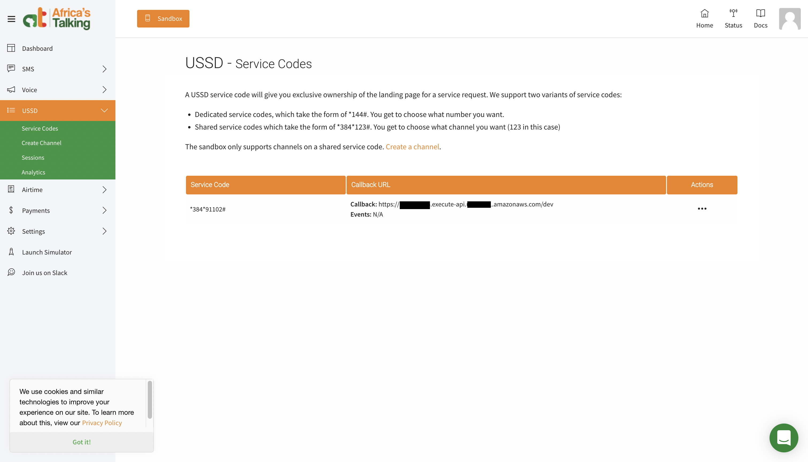  

And that's it! Any request to the USSD short code provided will be routed to your AWS application.