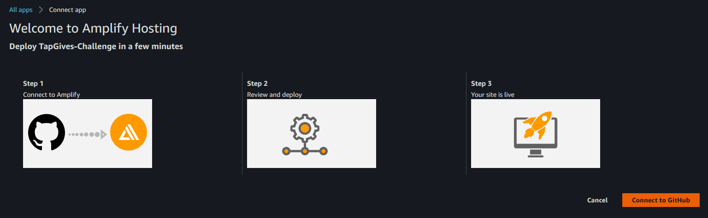
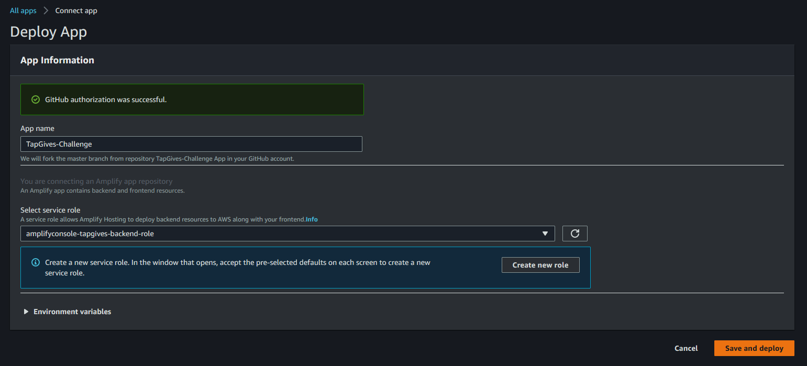
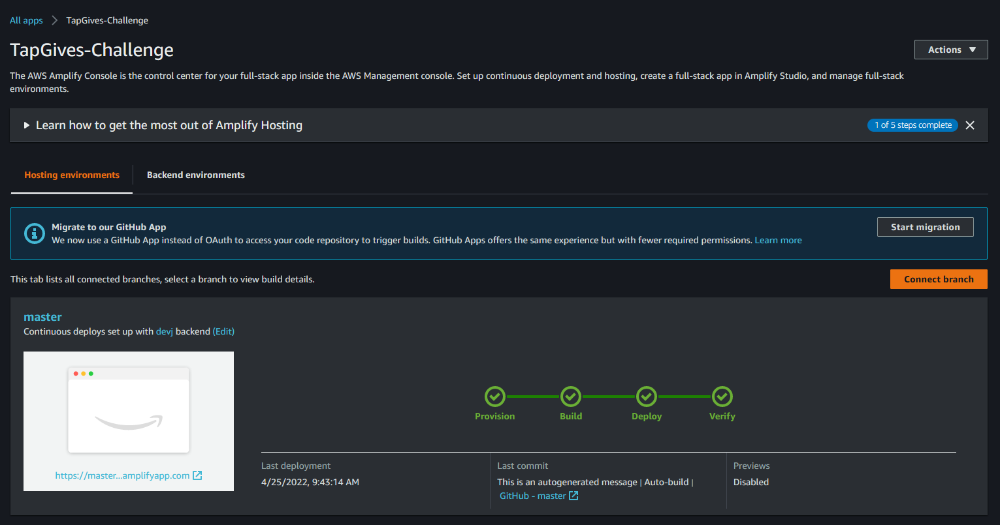
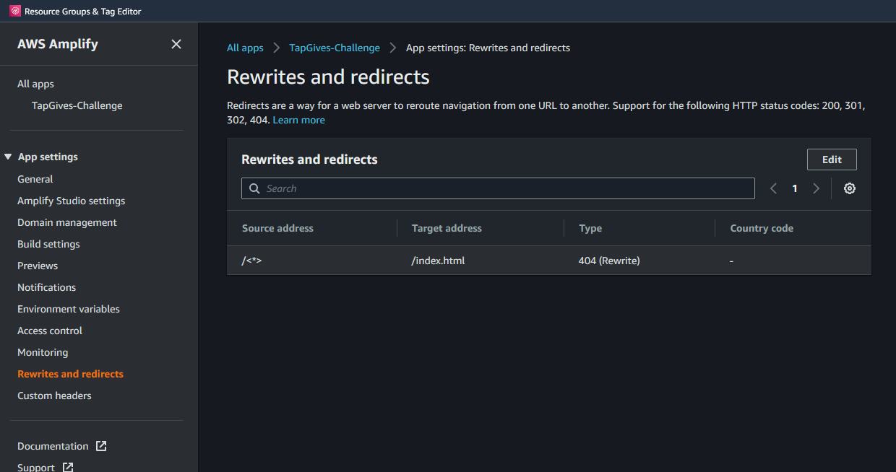
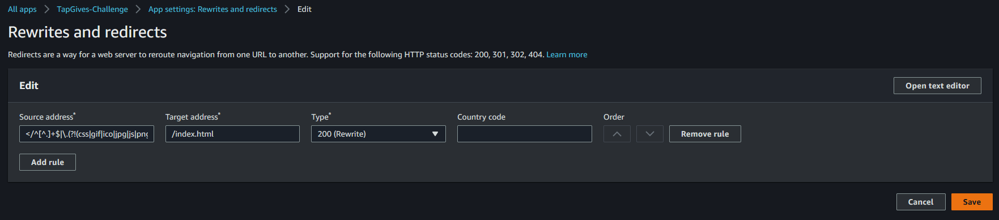

# Requirements

Before you deploy, you must have the following in place:
*  [AWS Account](https://aws.amazon.com/account/) 
*  [GitHub Account](https://github.com/) 
*  [AWS CLI](https://aws.amazon.com/cli/) 
*  [AWS SAM](https://docs.aws.amazon.com/serverless-application-model/latest/developerguide/serverless-sam-cli-install.html)  


# Step 1: Clone The Repository

First, clone the github repository onto your machine. To do this:
1. Create a folder on your desktop to contain the code.
2. Open terminal (or command prompt if on windows) and **cd** into the above folder.
3. Clone the github repository by entering the following:
```bash
git clone https://github.com/UBC-CIC/TapGives.git
```

The code should now be in the above folder. Now navigate into the TapGives folder by running the following command:
```bash
cd TapGives
```


# Step 2: Frontend Deployment

Before installing Amplify we need to create the IAM Role that associate the policies need to implement this solution. 
Navigate to the cloned directory, execute the follow CloudFormation template:

```bash
aws cloudformation deploy --template-file cfn-amplifyRole.yaml --stack-name amplifyconsole-tapgives-backend-role --capabilities CAPABILITY_NAMED_IAM
```

If you have multiple AWS Profiles, specify one with sufficient admin permissions by appending this to the command, replacing the profile name 

```bash
--profile [PROFILE NAME]
```
The previous command creates the role name **amplifyconsole-tapgives-backend-role** that will be used on the next step.

The **Deploy to Amplify Console** button will take you to your AWS console to deploy the front-end solution.

<a href="https://console.aws.amazon.com/amplify/home#/deploy?repo=https://github.com/UBC-CIC/TapGives">
    
</a>

1. On the AWS console. select your region on the top right, then connect to github
2. Select the **amplifyconsole-tapgives-backend-role** for deployment
3. The deployment will take a few minutes.  Wait until the status shows **Verify** in green
4. Click on left taskbar to open menu, click on Rewrites and redirects, and click on edit 
5. Click and replace the first rule's source address (or add a rule if there is none) to ```</^[^.]+$|\.(?!(css|gif|ico|jpg|js|png|txt|svg|woff|woff2|ttf|map|json)$)([^.]+$)/>```, click and replace target address to ```/index.html```, and select and replace **type** with ```200 (Rewrite)```, then save.  
Refer to [AWS's Page on Single Page Apps](https://docs.aws.amazon.com/amplify/latest/userguide/redirects.html#redirects-for-single-page-web-apps-spa) for further information on why we did that


Congratulations, your web app is now deployed!

## Register TapGives Admin Account
Here, you'll learn how to register for an account on the web app, then how to set any accounts to TapGives Admin.
1. At the login page for the TapGives website, click create an account \
   
2. Enter Account Details and click Sign-up.  **Verification code is sent to email.** \
   
3. User retrieves verification code from email and enters it to Verify Account\
   
4. At the [AWS online console](https://console.aws.amazon.com/console/home), enter **Cognito** in the search bar \
   
5. Select the user pool corresponding to the project name (Default tapgiveschallenge) \
   
6. Select the user which you want to set to Admin \
   
7. Scroll down, and click **Add user to group** \
   
8. Select **Admins** and click **Add**  \
   
9. You have set up login credentials.  Return to TapGives web app, and login. Your user is now a TapGives Admin! (If you are having issues, try relogging on the TapGives web app)\
   

## Set Default Localization
This will set the localization used for both the web app and the USSD menu
1. Click the dropdown at the top left, and select Site Customers \
   
2. Click **Set Default Localization** on the right-hand side, and follow the menu.  This will overwrite any existing localization files and reset localization to defaults.  \
   


# Step 3: USSD Deployment

In this section you will configure three services that work in conjunction with one another to support the USSD capabilities of this solution. Firstly, you will create an M-Pesa application and take it live. Secondly, you will deploy the AWS infrastructure and, finally, you will configure the Africa's Talking service to interact with the AWS components.  

### M-Pesa Setup

In this section, you will do the following:
1. Create an M-Pesa Till that funds will be collected into (analogous to a mobile bank account).
2. Create an account with Daraja, Safaricom's API system.
3. Create an application on Daraja.
4. Take the application live.  

Please follow [these instructions](./MpesaDeploymentGuide.md) to do so.  

Before you move on to the next step, ensure you have the following information:
- Business Short Code
- Client Key
- Client Secret
- Pass Key    

### AWS Deployment 

As this solution involves sending SMS messages to customers using the Amazon Pinpoint service, you will first need to request a short code. A short code is a three to seven digit number that you can use for high-volume SMS message sending. They are often used for application-to-person (A2P) messaging, two-factor authentication (2FA), and marketing. To request a short code from AWS, complete **only Step 1** of the official [AWS short code request guide](https://docs.aws.amazon.com/pinpoint/latest/userguide/channels-sms-awssupport-short-code.html). *Please note: this solution utilizes the `TRANSACTION` message type - this will be one of the questions asked in the request form.*

Once you have the Amazon Pinpoint short code, you can proceed. By this point, you should the following information:
- Business Short Code
- Client Key
- Client Secret
- Pass Key
- Pinpoint short code

As this solution involves sending SMS messages to customers using the Amazon Pinpoint service, you will first need to request a short code. A short code is a three to seven digit number that you can use for high-volume SMS message sending. They are often used for application-to-person (A2P) messaging, two-factor authentication (2FA), and marketing. To request a short code from AWS, complete **only Step 1** of the official [AWS short code request guide](https://docs.aws.amazon.com/pinpoint/latest/userguide/channels-sms-awssupport-short-code.html). *Please note: this solution utilizes the `TRANSACTION` message type - this will be one of the questions asked in the request form.*  

Once you have the Amazon Pinpoint short code, you can proceed. By this point, you should the following information:
- Business Short Code
- Client Key
- Client Secret
- Pass Key
- Pinpoint short code  

With the above information, we can now deploy the AWS infrastructure. To do so, run the following commands in sequence:
```bash
cd ussd-app
./layers_install.sh
sam build
sam deploy --guided --capabilities CAPABILITY_NAMED_IAM
```  

When the configurations prompts appear, enter information similar to the below. Default values appear within the default brackets.

```bash
Configuring SAM deploy
======================

    Looking for config file [samconfig.toml] :  Not found

    Setting default arguments for 'sam deploy'
    =========================================
    Stack Name [sam-app]: ussd-app
    Parameter ProjectName [ussd-app]:
    Parameter EnvironmentName [dev]:
    Parameter PinpointShortcode []: <YOUR PINPOINT SHORTCODE> 
    Parameter MpesaAccountReference []: <YOUR MPESA ACCOUNT REFERENCE>
    Parameter MpesaBusinessShortcode []: <YOUR MPESA BUSINESS SHORTCODE>
    Parameter MpesaCallbackURL []: <YOUR CALLBACK URL>
    Parameter MpesaClientKey []: <YOUR MPESA CLIENT KEY>
    Parameter MpesaClientSecret []: <YOUR MPESA CLIENT SECRET>
    Parameter MpesaPassKey []: <YOUR MPESA PASSKEY>
    Confirm changes before deploy [y/N]:
    Allow SAM CLI IAM role creation [Y/n]: 
    Disable rollback [y/N]: 
    USSDMenu may not have authorization defined, Is this okay? [y/N]: y
    Save arguments to configuration file [Y/n]: 
    SAM configuration file [samconfig.toml]: 
    SAM configuration environment [default]: 
```  

**Important:**  
You can find your API Gateway Endpoint URL in the output values displayed after deployment. This URL will be provided to Africa's Talking as the *Callback URL*. The output should look like so:  


### Africa's Talking Setup

Lastly, follow [these instructions](./AfricasTalkingDeployment.md) to launch a USSD service code via Africa's Talking. Keep the API Gateway URL from above on hand.  

# Troubleshooting  

### Error #1
If you encounter the following error:
```bash
The config profile could not be found
```  
chances are that the AWS CLI has not been correctly configured. Ensure you have correctly done so by following the [AWS CLI setup guide](https://aws.amazon.com/cli/), as indicated in the requirements section.  

### Error #2
If you encounter the following error: 
```bash
An error occurred: <lambda /function name> - Uploaded file must be a non-empty zip ... Status Code: 400; Error Code: InvalidParameterValueException
```  
the problem is most likely due to the Node version being used, as indicated in [this thread](https://github.com/serverless/serverless/issues/8794). The solution is to **downgrade to a stable version of Node**.