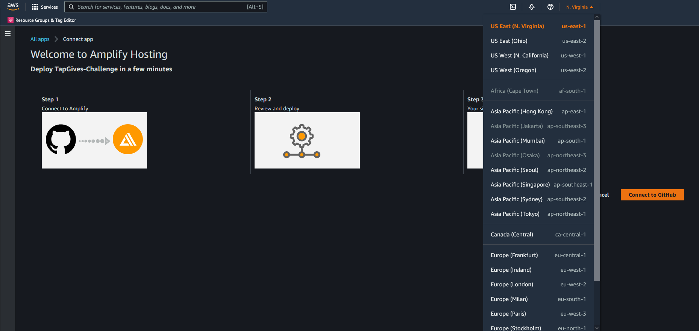

# Requirements

Before you deploy, you must have the following in place:
*  [AWS Account](https://aws.amazon.com/account/) 
*  [GitHub Account](https://github.com/) 
*  [AWS CLI](https://aws.amazon.com/cli/) 
*  [AWS SAM](https://aws.amazon.com/serverless/sam/)  


# Step 1: Clone The Repository

First, you will need to clone the github repository onto your machine. To do this:
1. Create a folder on your desktop to contain the code.
2. Open terminal (or command prompt if on windows) and **cd** into the above folder.
3. Clone the github repository by entering the following:
```bash
git clone https://github.com/UBC-CIC/TapGives-Challenge.git
```

The code should now be present in the above folder.  


# Step 2: Frontend Deployment

Before installing Amplify we need to create the IAM Role that associate the policies need to implement this solution. From the cloned directory, execute the follow CloudFormation template:

```bash
aws cloudformation deploy --template-file cfn-amplifyRole.yaml --stack-name amplifyconsole-tapgives-backend-role --capabilities CAPABILITY_NAMED_IAM
```
It creates the role name **amplifyconsole-tapgives-backend-role** that will be used on the next step.

The **Deploy to Amplify Console** button will take you to your AWS console to deploy the front-end solution.

<a href="https://console.aws.amazon.com/amplify/home#/deploy?repo=https://github.com/UBC-CIC/TapGives-Challenge">
    
</a>

1. 
2. Select the **amplifyconsole-tapgives-backend-role** for deployment
3. Continue, and wait until the project is finished deployment (wait until the verify is green and checked) 
4. Open left taskbar, Rewrites and redirects, and open edit 
5. Change first rule's source address (or add a rule if there is none) to ```</^[^.]+$|\.(?!(css|gif|ico|jpg|js|png|txt|svg|woff|woff2|ttf|map|json)$)([^.]+$)/>```, target address to ```/index.html```, and type to ```200 (Rewrite)```, then save

Congratulations, your web app is now deployed!

# Step 3: USSD Deployment

### M-Pesa Setup

In this section, you will do the following:
1. Create an M-Pesa Till that funds will be collected into (analogous to a mobile bank account).
2. Create an account with Daraja, Safaricom's API system.
3. Create an application on Daraja.
4. Take the application live.  

Please follow [these instructions](./MpesaDeploymentGuide.md) to do so.  

Before you move on to the next step, ensure you have the following information:
- Business Short Code
- Client Key
- Client Secret
- Pass Key    

### AWS Deployment 

With this information, we can now deploy on AWS. To build and deploy the application, run the following commands consecutively:

```bash
cd ussd-app
sam build
sam deploy --guided --capabilities CAPABILITY_NAMED_IAM
```  

When the configurations prompts appear, enter information similar to the below. Default values appear within the default brackets.

```bash
Configuring SAM deploy
======================

    Looking for config file [samconfig.toml] :  Not found

    Setting default arguments for 'sam deploy'
    =========================================
    Stack Name [sam-app]: ussd-app
    AWS Region [us-east-1]: <YOUR REGION>
    Parameter ProjectName [ussd-app]: 
    Parameter EnvironmentName [dev]: 
    Parameter MpesaAccountReference []: <YOUR MPESA ACCOUNT REFERENCE>
    Parameter MpesaBusinessShortcode []: <YOUR MPESA BUSINESS SHORTCODE>
    Parameter MpesaCallbackURL []: <YOUR CALLBACK URL>
    Parameter MpesaClientKey []: <YOUR MPESA CLIENT KEY>
    Parameter MpesaClientSecret []: <YOUR MPESA CLIENT SECRET>
    Parameter MpesaPassKey []: <YOUR MPESA PASSKEY>
    Confirm changes before deploy [y/N]:
    Allow SAM CLI IAM role creation [Y/n]: 
    Disable rollback [y/N]: 
    USSDMenu may not have authorization defined, Is this okay? [y/N]: y
    Save arguments to configuration file [Y/n]: 
    SAM configuration file [samconfig.toml]: 
    SAM configuration environment [default]: 
```  

**Important:**  
You can find your API Gateway Endpoint URL in the output values displayed after deployment. This URL will be provided to Africa's Talking as the *callbackUrl*. The output should look like so:  


### Final Steps

Lastly, follow [these instructions](./AfricasTalkingDeployment.md) to launch a USSD service code via Africa's Talking. Keep the API Gateway URL from above on hand.