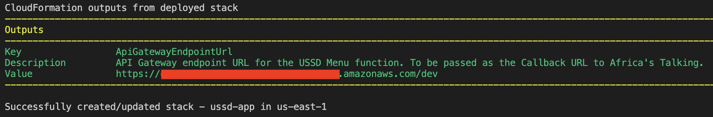

# Requirements

Before you deploy, you must have the following in place:
*  [AWS Account](https://aws.amazon.com/account/) 
*  [GitHub Account](https://github.com/) 
*  [AWS CLI](https://aws.amazon.com/cli/) 
*  [AWS SAM](https://aws.amazon.com/serverless/sam/)  

# Step 1: Clone The Repository

First, you will need to clone the github repository onto your machine. To do this:
1. Create a folder on your desktop, name it *TapGives* (folder location and name are suggestions).
2. Open terminal (or command prompt if on windows) and **cd** into the above folder.
3. Clone the github repository by entering the following:
```bash
git clone https://github.com/UBC-CIC/TapGives-Challenge.git
```

A folder named *TapGives-Challenge* should now be present in the *TapGives* folder.  

# Step 2: Frontend Deployment


# Step 3: USSD Deployment

### Collect Prerequisite Information

Log into the AWS Console and retreive the following: 
>>   
1. AppSync API URL and AppSync API ID
>> 
>> 
>> 
>> 
2. S3 Bucket Name and Languages File Path (default path is *public/basePhrases.json*)
>> 
>> 
>> 
>>   

Log into your Daraja Account and retreive the following application details:
- Business Short Code
- Client Key
- Client Secret
- Pass Key  

### Deployment 

To build and deploy your application for the first time, run the following in your shell:

```bash
sam build
sam deploy --guided --capabilities CAPABILITY_NAMED_IAM
```  

When the configurations prompts appear, do the following:
- Name the stack. Below, the stack is named 'ussd-app.'
- Provide the region of deployment. See AWS regions for more information.
- Select an environment name; typically either 'dev' or 'prod.'
- Provide the AppSync API URL from above.
- Provide the AppSync API ID from above.
- Provide the S3 Bucket name from above.
- Provide the path to 'basePhrases.json' from above.
- Provide M-Pesa details from above.
- Enter 'y' for the USSDMeny authorization question.
- Accept default values for all else.  

The output should be similar to:  
```bash
Setting default arguments for 'sam deploy'
=========================================
Stack Name [sam-app]: ussd-app
AWS Region [us-east-1]: us-west-2
Parameter ProjectName [ussd-app]: 
Parameter EnvironmentName [dev]: 
Parameter AppSyncApiUrl []: <YOUR APPSYNC API URL>
Parameter GraphQLApiId []: <YOUR APPSYNC API ID>
Parameter S3BucketName []: <YOUR BUCKET NAME>
Parameter LanguagesFilePath []: <PATH TO FILE>
Parameter MpesaAccessTokenUrl []: <MPESA URL FOR ACCESS TOKENS> # provide
#The below will be the name that appears in the M-Pesa prompt
Parameter MpesaAccountReference []: <YOUR ACCOUNT REFERENCE NAME>
Parameter MpesaBusinessShortcode []: <YOUR BUSINESS SHORTCODE>
#You can include a callback URL if you like - it is not necessary.
#Below is the M-Pesa simulation default.
Parameter MpesaCallbackURL []: https://mydomain.com/path
Parameter MpesaClientKey []: <YOUR MPESA CLIENT KEY>
Parameter MpesaClientSecret []: <YOUR MPESA CLIENT SECRET>
Parameter MpesaPassKey []: <YOUR MPESA PASS KEY>
Parameter MpesaInitiatePaymentUrl []: <MPESA URL FOR LIPA NA MPESA INITIATION> # provide
Parameter MpesaQueryUrl []: <MPESA URL FOR LIPA NA MPESA QUERY> # provide
#Shows you resources changes to be deployed and require a 'Y' to initiate deploy
Confirm changes before deploy [y/N]:
#SAM needs permission to be able to create roles to connect to the resources in your template
Allow SAM CLI IAM role creation [Y/n]:  
#Preserves the state of previously provisioned resources when an operation fails
Disable rollback [y/N]: 
#This enables the USSD Menu lambda function to be invoked by API Gateway
USSDMenu may not have authorization defined, Is this okay? [y/N]: y
Save arguments to configuration file [Y/n]: 
SAM configuration file [samconfig.toml]: 
SAM configuration environment [default]:
```

Important:
You can find your API Gateway Endpoint URL in the output values displayed after deployment. This URL will be provided to Africa's Talking as the *callbackUrl*. The output should look like so:
