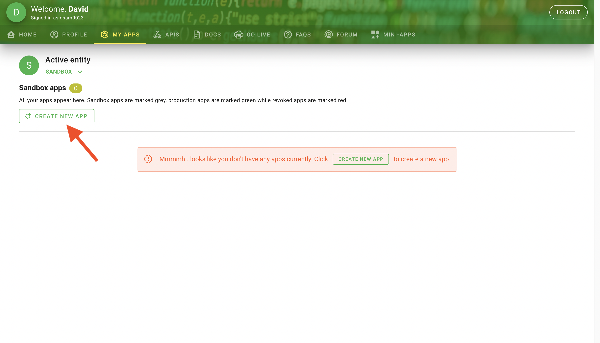
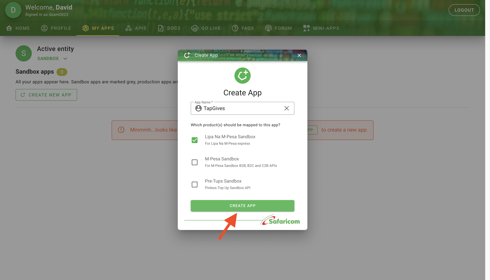
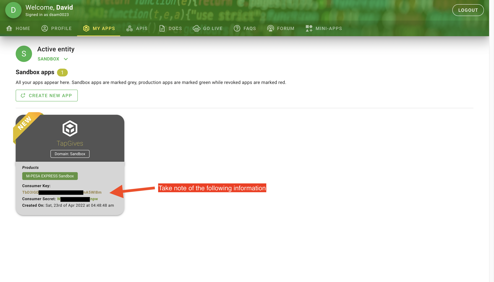
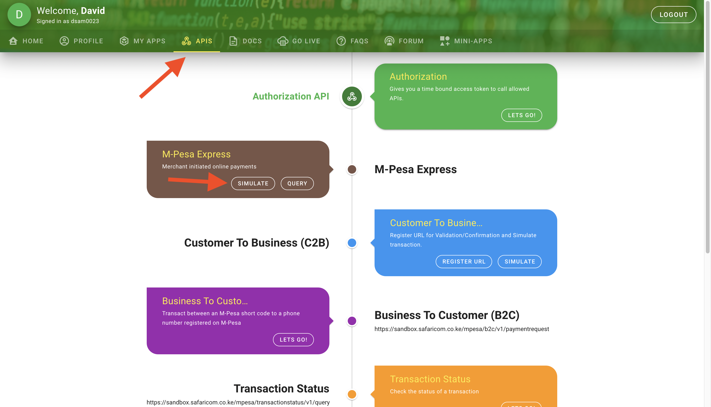
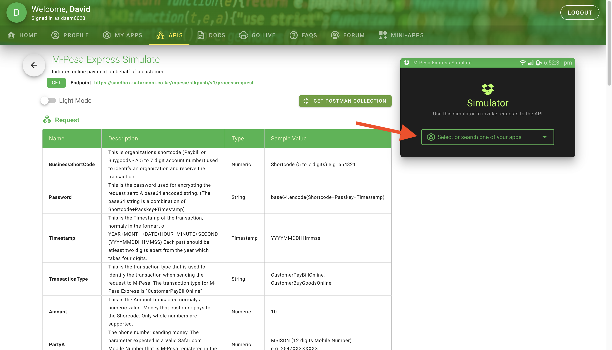
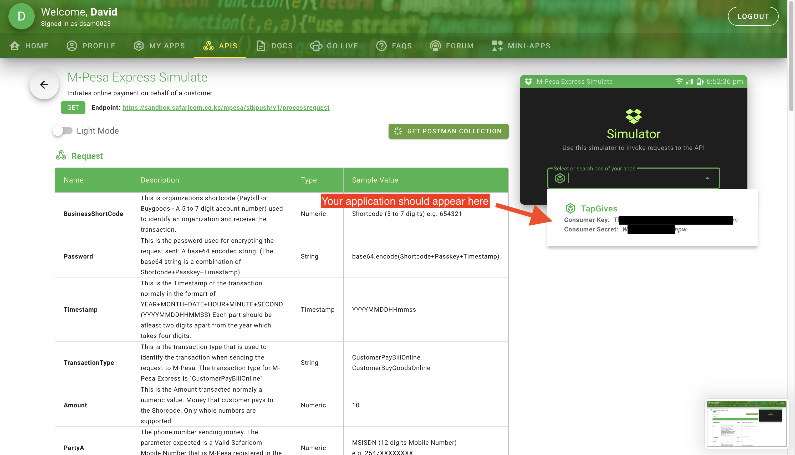
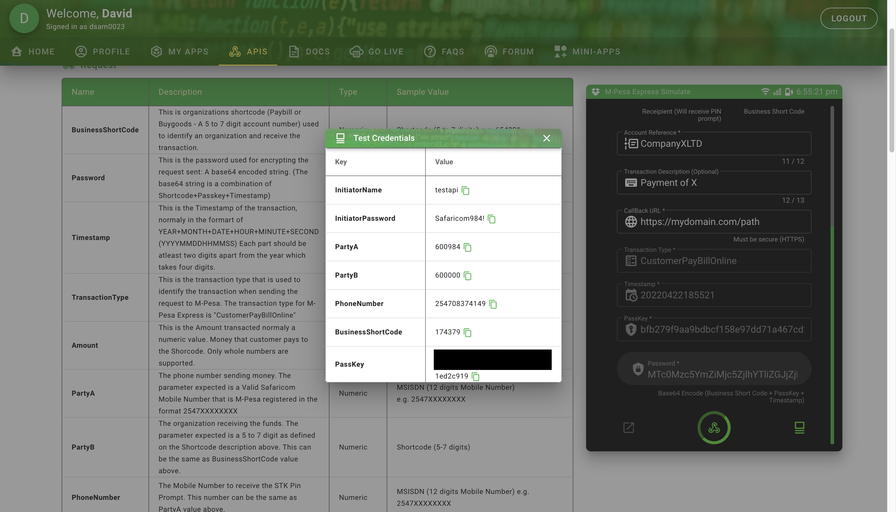
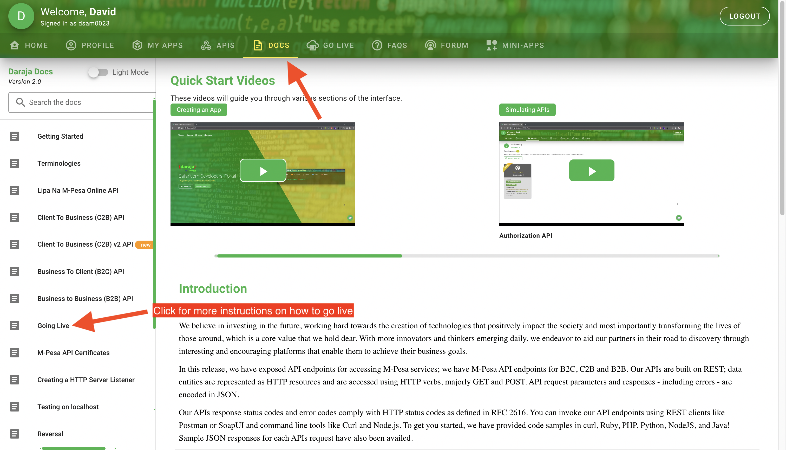
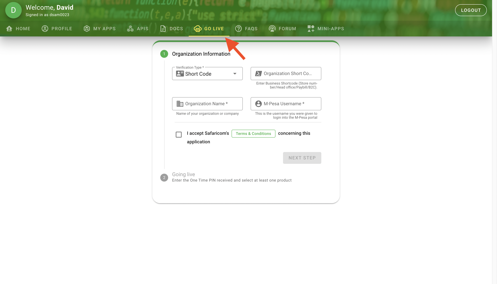

# Step 1: Aquire an M-Pesa Till
The M-Pesa till ​​enables business owners to collect payments on the till and use the money collected to make other transactions directly from their till, to a bank account for example. See their [official website](https://m-pesaforbusiness.co.ke/) for instructions on opening a till.  

To proceed, you will need a Business Shortcode (Store number/Head office/Paybill/B2C).

# Step 2: Create an M-Pesa Daraja Account and Application
Daraja is Safaricom's Developer Portal that provides Safaricom's APIs and API documentation.  

To begin, visit the [official website](https://developer.safaricom.co.ke/) and create an account.  

Once you're logged in, follow these steps:  

# Step 3: Take the Application Live

