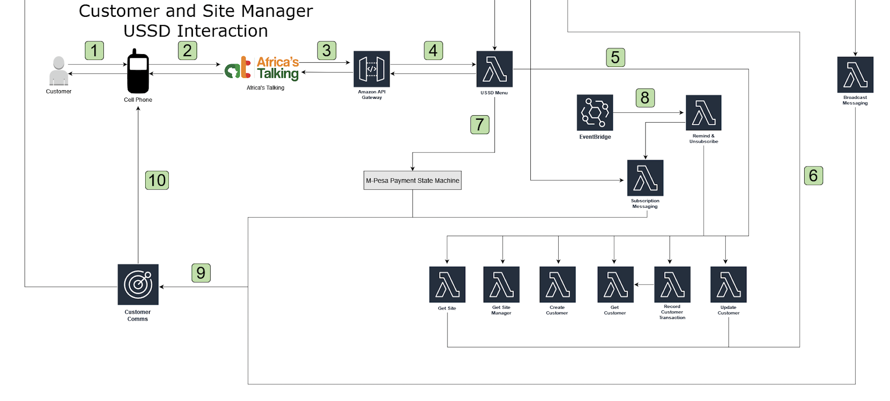
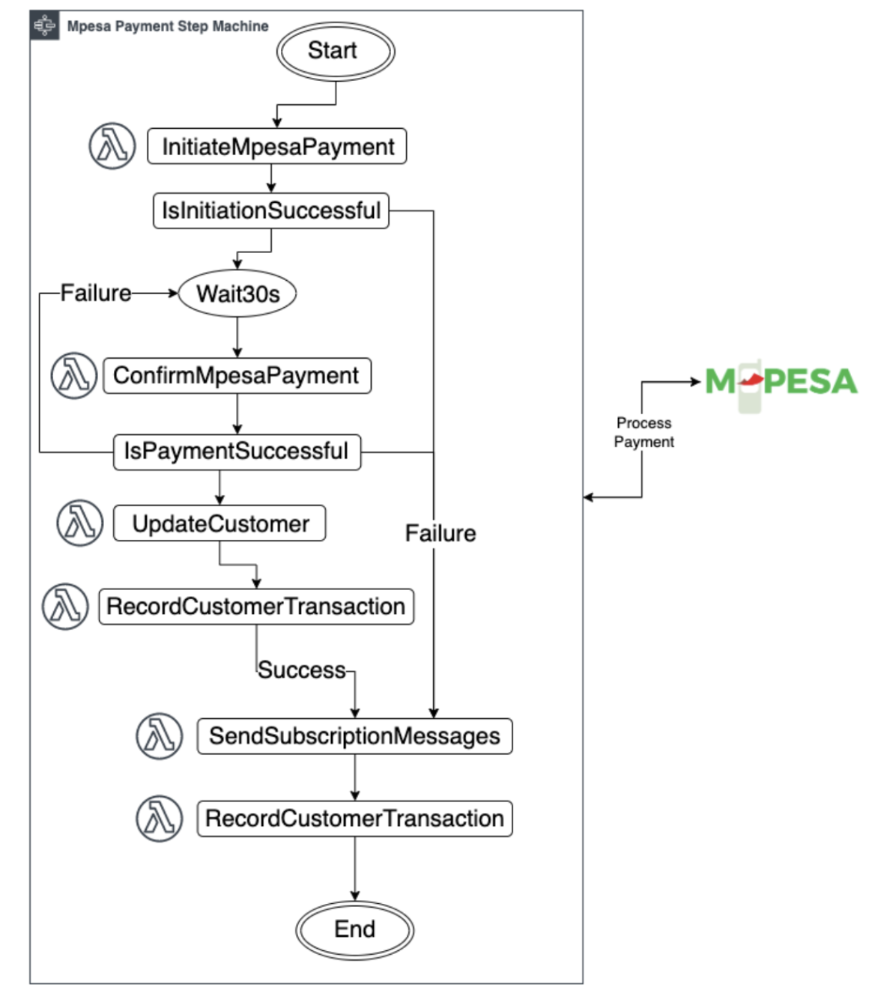

# Customer and Site Manager USSD Architecture

  

The diagram above depicts the components utilized when a villager or site manager interacts with the system using USSD. Through this interaction, a customer will be able to register with the TapGives project, purchase a subscription to a water site, and view important information such as their monthly subscription code and monthly jerrycan balance. In addition, the USSD interaction allows site managers to verify the subscription of a customer and to process customer collections. The following details the components utilized and their functions:
1. A villager or site manager can use any cellular device.
2. The user dials the TapGives USSD shortcode for this solution (e.x. *123#), making a request to open a bridge of communication with the system. The Mobile Network Operator (MNO), for example, Safaricom, facilitates this request by forwarding it to the USSD Gateway aggregation service, Africa’s talking. 
3. Africa’s Talking receives the request and forwards it to the Amazon API Gateway endpoint listed for the TapGives USSD shortcode. This connection opens the bridge of communication that will last until the session is terminated or times out.
4. Throughout the user’s interaction with the system, Amazon API Gateway will be the passageway through which user information is received and system responses are sent. As such, Amazon API Gateway modifies the contents being received and sent so as to match the formats expected by both Africa’s Talking and the lambda function that directs the entire user interaction, USSD Menu.
5. In directing the user interaction, the USSD Menu AWS Lambda function invokes six lambda functions to perform tasks such as customer creation, the modification of customer information, the recording of customer transactions, and the retrieval of customer, site and site manager information. The lambda functions, detailed below, appear as the row of functions in the architecture diagram.
    1. CreateCustomer: Creates a customer in the database with information provided through the menu interaction.
    2. GetCustomer: Retrieves customer details from the database.
    3. UpdateCustomer: Update customer details in the database.
    4. GetSiteManager: Retrieves site manager details from the database.
    5. GetSite: Retrieves site details from the database.
    6. RecordCustomerTransaction: Records customer transactions in the database, such as subscriptions, unsubscriptions and site visits.
6. The system utilizes Amazon DynamoDB database as the sole form of information storage and, as such, the aforementioned helper functions interact with it to read and write customer and transaction information.
7. When a user initiates a subscription purchase, the USSD Menu function invokes the AWS Step Function, named MpesaStateMachine, which automates this process with a series of lambda functions and states. The step function will be shown in further detail below, in section 4.2.2.2.
8. On a daily basis, the RemindAndUnsubscribe lambda function is triggered to do the following:
    1. Remind appropriate customers that their expiration is about to expire.
    2. Unsubscribe and notify customers whose expirations have expired.
9. SMS is an important way in which the system communicates information to the user. For example, in the case of a customer subscription, the system sends an SMS message to the customer informing them of the success of their payment and subsequent subscription to the TapGives service. Whenever SMS communication is required, an SMS request, which includes a destination phone number and a message, is sent to the Amazon Pinpoint service named CustomerComms
    1. This request is created by the Subscription Messaging lambda function in the event of a subscription, unsubscription or reminder. 
    2. In the event of a broadcast message, this request is created by the Broadcast Messaging lambda function.
10. Amazon Pinpoint sends the provided message to the provided destination phone number. This phone number can belong to a customer, who would receive subscription or broadcast messages, or a site manager, who would only receive broadcast messages.  

### M-Pesa Step Function (State Machine)

  

The above AWS step function workflow is responsible for processing monthly customer payments to a water filtration site; this interaction will be required every month, using an M-PESA Till, a business account dedicated to collecting funds (See Appendix C for more information). The transaction of funds from a customer to TapGives is made possible by Safaricom’s M-PESA payment API (more details are available in the [Safaricom API documentation](https://developer.safaricom.co.ke/APIs)). In addition to processing this transaction, the AWS step function workflow updates the customer’s subscription status, withdraws funds from the customer’s account, records the transaction, and sends a message to the customer indicating the success of the transaction and the change in their subscription status. Following is a typical flow for the payment step function:
1. The InitiateMpesaPayment Lambda function obtains a time-bound access token from M-PESA (Authorization API) and initiates an online payment (Lipa Na M-PESA Online / M-PESA Express Simulate API). If successful, a pop-up message prompts the customer to enter their M-PESA PIN to proceed with the transaction. If unsuccessful, a message is sent to the customer asking them to retry. 
2. After a thirty-second wait time, the ConfirmMpesaPayment Lambda function is invoked to query whether or not the transaction was successful (Lipa Na M-PESA Online Query / M-PESA Express Query API). This API call is made at most four times if the status of the transaction is ‘not successful’ each time a query is made to M-PESA. After the fourth ‘not successful,’ a message is sent to the customer asking them to retry.
3. If the transaction is successfully completed, the customer’s information is updated (subscription is changed to ‘valid’ and their subscription expiration is set to 30 days from the current date). This update of a customer’s information is recorded as a customer transaction.
4. Once the update is complete, a message is sent out to the customer informing them of the success of their payment.
