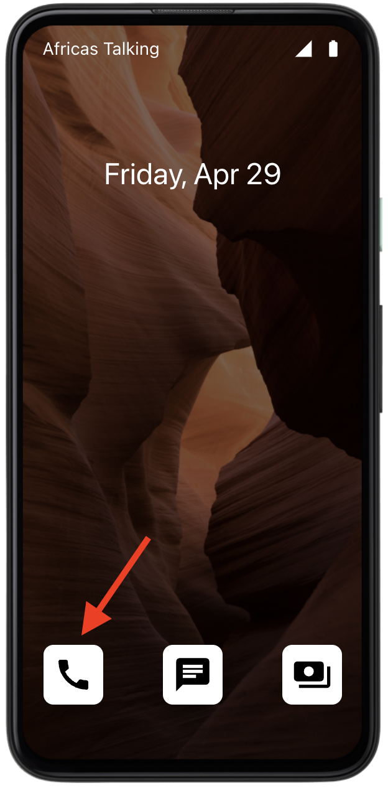

# Requirements  
Ensure you have deployed the entire solution. If not, follow [these instructions](./DeploymentGuide.md) first.  

# Notices and Assumptions:  

Notice:  
The phone simulator depicted below is provided by courtesy of Africa's Talking. As a result, take note of the following:
1. The mobile network operator (as displayed on the top left of the phone) is shown as "Africa's Talking." In reality, this would be a local mobile network operator such as Safaricom, Airtel and so on (akin to Bell, Rogers, AT&T, etc...).
2. Although the simulator depicts a smartphone, this solution operates on any cellular device.  

Assumptions:
1. For the purposes of this demonstration, we assume the service code provided by Africa's Talking is _*384*91102#_.

# Part 1: Customer Registration

  

# Part 2: Customer Subscription Purchase

# Part 3: Customer Subscription Details

# Part 4: Site Manager Collection Authorization

