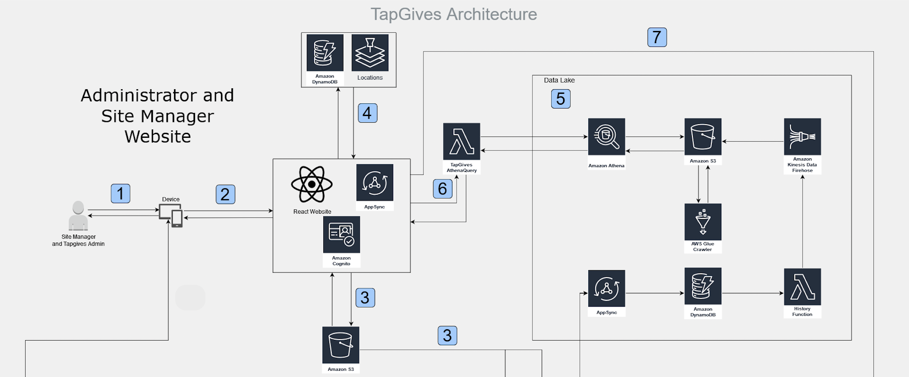

# Administrator and Site Manager Web Application Architecture 

  

The web application provides water filtration site specifications, site manager and customer information, as well as insight into customer visit habits. TapGives administrators can create and update water filtration sites in the system, grant permissions to site managers and update the language localization for both the website and mobile interfaces. The following details the solution's components utilized and their functions:  
1. The user (Site Manager or TapGives Admin) chooses a device to use, any device will work provided it is capable of displaying a webpage in a modern browser (desktop, laptop, smartphone).
2. The user connects to the webpage, where access to AWS resources is done through authentication using AWS Cognito, and then requests are routed through AWS Appsync.  
3. When the user logs in, the application loads the selected language from an Amazon S3 bucket. The phrase list is downloaded when connecting to a website and is automatically updated by checking the Amazon S3 bucket for any updates for each reconnection.  Administrators can change the phrases on the Amazon S3 bucket to change the user’s localization.
4. Through AWS AppSync and Cognito, the solution retrieves information about the filtration sites and a corresponding map using Amazon DynamoDB and Amazon Locations. The Amazon DynamoDB contains information such as the name, shortcode, and physical coordinates of each site, while Amazon Locations is able to provide a map using those coordinates.
5. When a customer transaction is added, the transaction is passed to Amazon DynamoDB streams, which passes it to a AWS Lambda function. This function invokes Amazon Kinesis Data Firehose which aggregates data converted in the  parquet to be partitioned and stored in Amazon S3.  At the end of each day, an AWS Glue crawler will run through the entries and add any new entries into the glue data catalog for Amazon Athena to analyse.
6. The web portal analytics capabilities, such as the number of site visits by the hour in the last month, is processed through AWS AppSync, which calls a AWS Lambda function that converts the request to an SQL query for Amazon Athena.  Amazon Athena then performs an SQL query on the Amazon S3 bucket containing customer transactions, similar to a relational database
7. The solution uses AWS AppSync to broadcast messages to all customers in the system or to all customers from a water filtration site. The AWS AppSync resolver calls an AWS Lambda function which retrieves the relevant phone numbers and uses Amazon Pinpoint to message the appropriate customers and site managers.
