## Requirements

Before you follow the guide, you must have the following in place:
* [Web App Deployment](https://github.com/UBC-CIC/TapGives-Challenge/blob/master/docs/DeploymentGuide.md) 

| Index                                                           | Description                                   |
|:----------------------------------------------------------------|:----------------------------------------------|
| [Part 1 - Account Registrations](#Part-1-Account-Registrations) | Designating Site Managers and TapGives Admins | 
| [Part 2 - Water Site](#Part-2-Water-Site-Operations)            | Water Site Create/Read/Update                 | 
| [Part 3 - Customer Search](#Part-3-Customer-Search)             | Customer Search and Info                      |
| [Part 4 - Localization](#Part-4-Localization)                   | Localized web and USSD content                |

## Part 1 Account Registrations
| Index                                                  | Description                       |
|:-------------------------------------------------------|:----------------------------------|
| [Admin Registration](#Register-TapGives-Admin-Account) | Setting up TapGives Admin account | 
| [Site Manager Designation](#Designate-Site-Managers)   | Setting users as Site Managers    |

# Register TapGives Admin Account
Here, you'll learn how to register for an account on the web app, then how to set any accounts to TapGives Admin.
1. At the login page for the TapGives website, click create an account \
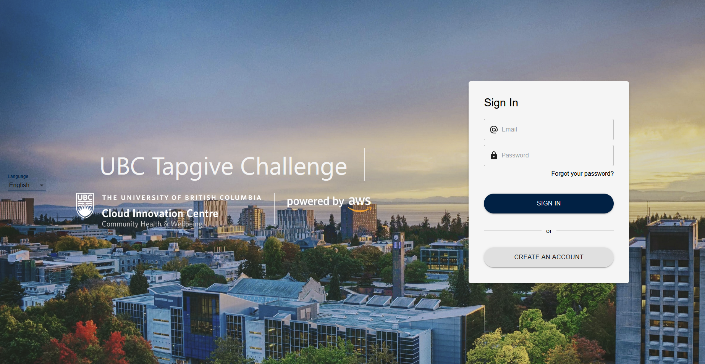
2. Enter Account Details and click Sign-up.  **Verification code is sent to email.** \

3. User retrieves verification code from email and enters it to Verify Account\
 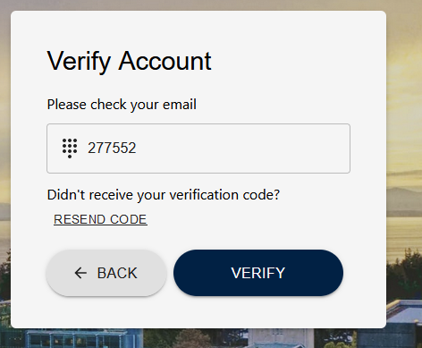
4. At the [AWS online console](https://console.aws.amazon.com/console/home), enter **Cognito** in the search bar \
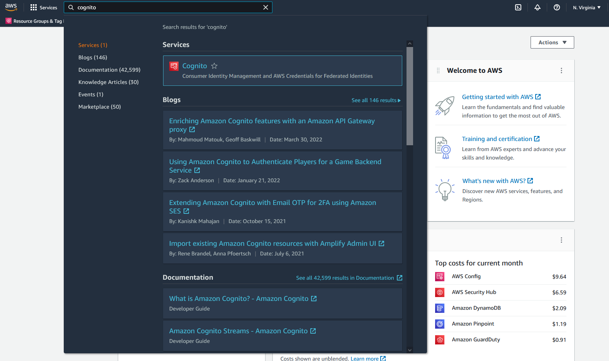 
5. Select the user pool corresponding to the project name (Default tapgiveschallenge) \
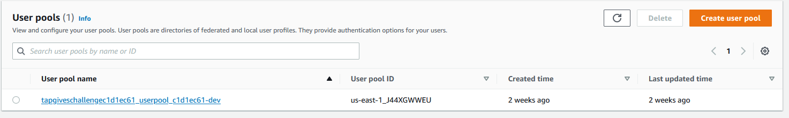
6. Select the user which you want to set to Admin \
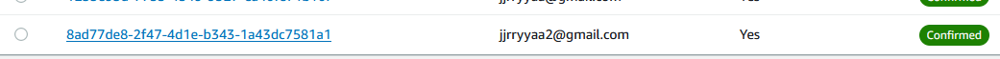
7. Scroll down, and click **Add user to group** \
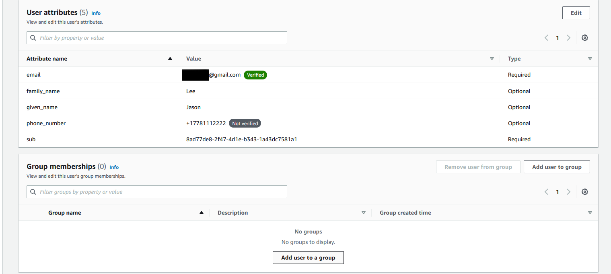
8. Select **Admins** and click **Add**  \
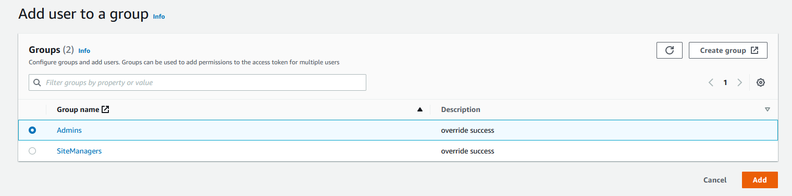
9. You have set up login credentials.  Return to TapGives web app, and login. Your user is now a TapGives Admin! (If you are having issues, try relogging on the TapGives web app)\
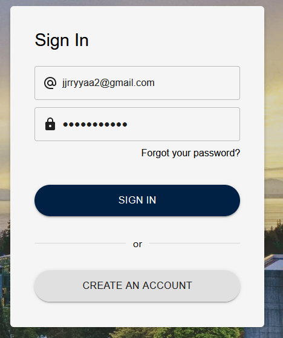

# Designate Site Managers
The instructions below assume that Site Managers already have web app accounts.  If this is not the case, refer to steps 1-3 in the [earlier steps](#Register-TapGives-Admin-Account)

1. Open the web app as a TapGives Admin account, and click the dropdown on the top left, select Administration \
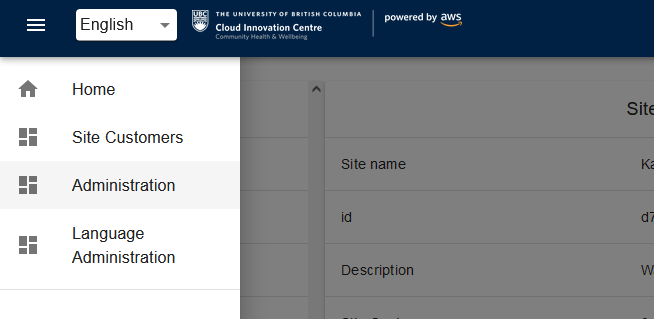
2. Select the user you want to designate as a Site Manager \
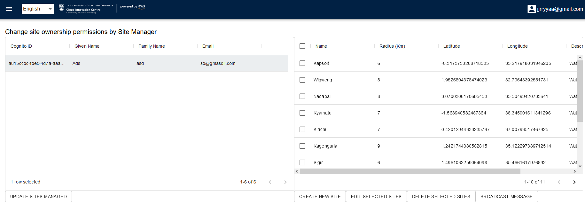
3. Select the sites you want them to manage \
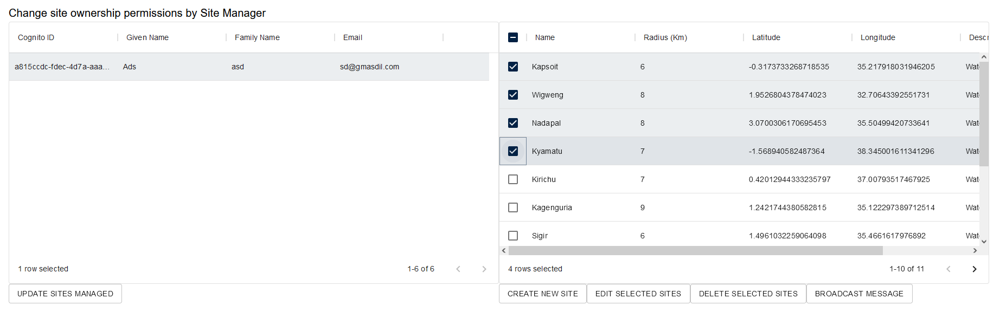
4. Click **Update Site Managed** to assign the Site Managers to the corresponding sites\
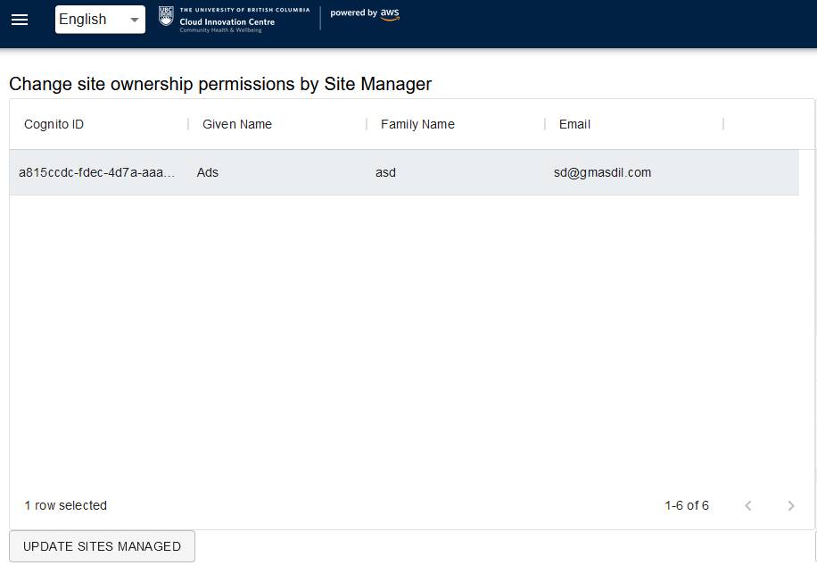

The user is now a Site Manager, and their phone number should work for the USSD code, and their account should be able to access their designated water sites on the web app.

## Part 2 Water Site Operations
| Index                                         | Description                    |
|:----------------------------------------------|:-------------------------------|
| [Create Site](#Create-Water-Filtration-Sites) | Create a water filtration site | 
| [Update Site](#Update-Water-Filtration-Sites) | Update water filtration site   |
| [Delete Site](#Delete-Water-Filtration-Sites) | Delete water filtration site   |

Open the web app as a TapGives Admin account, and click the dropdown on the top left, select Administration \

# Create Water Filtration Sites
Here are the general instructions on how to create a Water Filtration Site in the cloud
1. Click **Create New Site** \
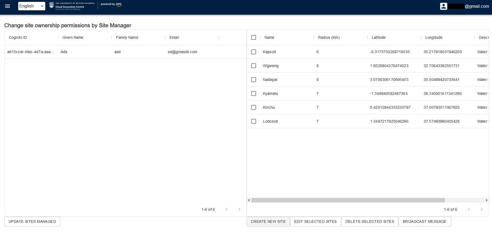
2. Fill in the relevant details, then click **Create** in the bottom right to create the site and sync to cloud\
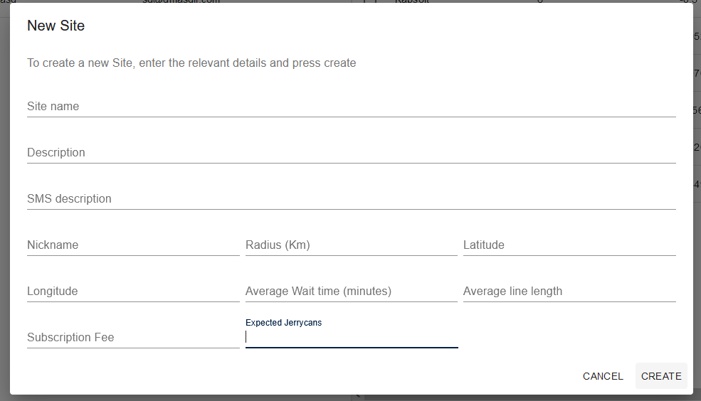

# Update Water Filtration Sites
Here are the general instructions on how to update any existing Water Filtration Sites
1. Select **one** water filtration site from the list \
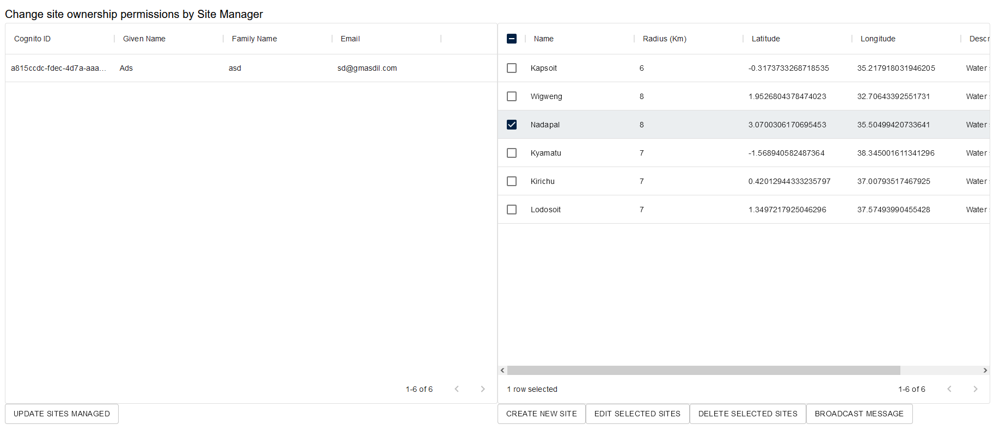
2. Edit relevant details, then click **Edit Selected Sites** to save changes to site and sync to cloud\
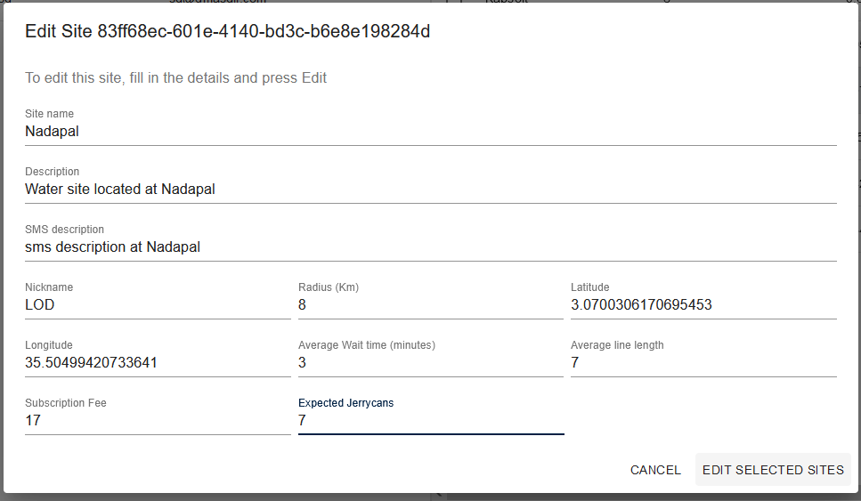

# Delete Water Filtration Sites
Here are the general instructions on how to delete any existing Water Filtration Sites from the cloud
1. Select as many water filtration sites from the list as you want to delete, then click **Delete Selected Sites** in the bottom right to delete all selected sites \
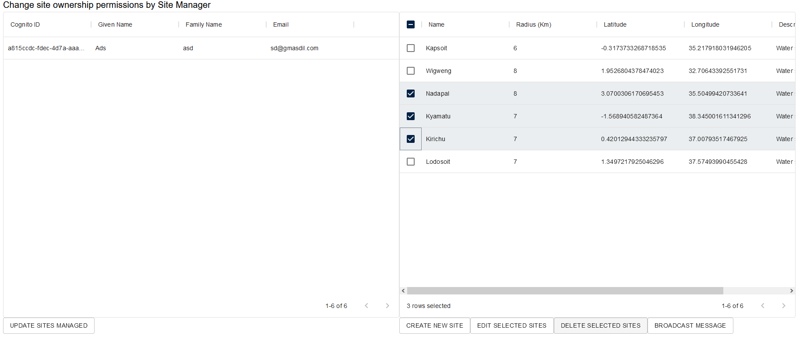

# Broadcast Message to all customers of a site
Here are the instructions on how to send a message to customers registered to any Water Filtration Site
1. Select as many water filtration sites from the list as you want to, then click **Broadcast Message** in the bottom right  \
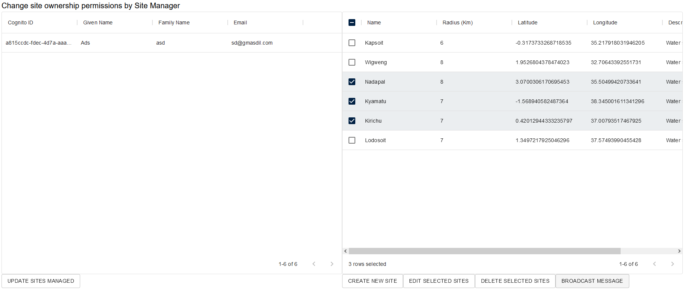
2. Enter in content to message, then click **Broadcast Message** to send messages to all customers registered to those sites  \
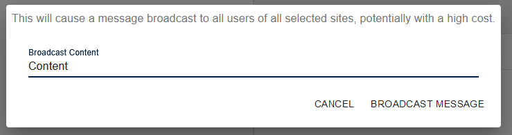

## Part 3 Customer Search

# Search with filters
Here you learn to use the search and filter through customers registered to Water Filtration Sites.
1. Click the dropdown at the top left, and select Site Customers \
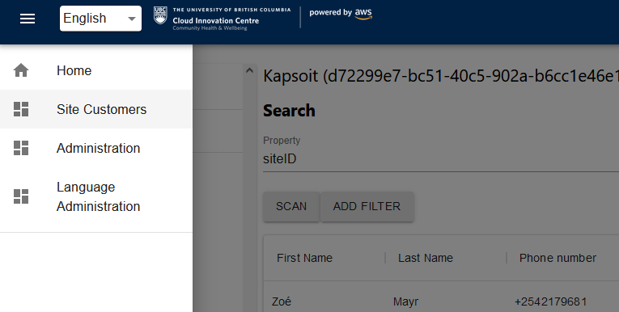
2. Click search property, and enter the column value you wish to filter on exactly as they are shown in the table below (case and space sensitive) \

3. If you'd like to have more filters, click **Add Filter** and select any of the properties you want. \
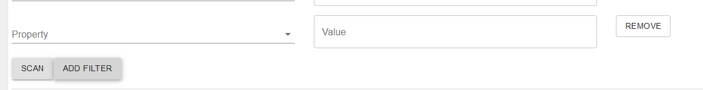
4. When you're done, click **Scan** to get results, and if not all the results are returned in one try, click **Get More Results** on the right-hand side for more entries

## Part 4 Localization
| Index                                             | Description                       |
|:--------------------------------------------------|:----------------------------------|
| [Default Localization](#Set-Default-Localization) | Set default languages             | 
| [Add New Language](#Add-new-Language)             | Add new language to localization  |
| [Delete Language](#Delete-Language)               | Delete language from localization |
| [Modify Localization](#Modify-Localization)       | Change localization phrases       |

Click the dropdown at the top left, and select Site Customers \
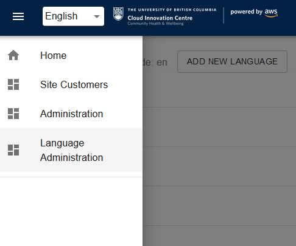

# Set Default Localization
This will set the localization used for both the web app and the USSD menu
1. Click **Set Default Localization** on the right-hand side, and follow the menu.  This will overwrite any existing localization files and reset localization to defaults.  \
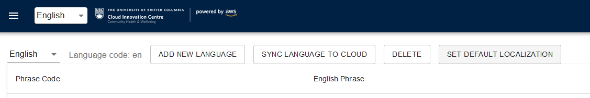

# Add new Language
This can add languages into the localization used for both the web app and the USSD menu
1. Click **Add New Language** on the top left-hand side, then follow the menu.  The "Language code" should be an unique 2 letter short code for your language (eg. "en").  "Language Name" should be the language name (eg. "English").  \
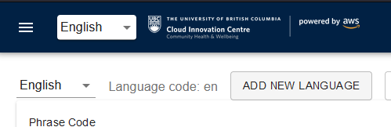
2. Click **Sync Language to Cloud** in the top middle of the screen to sync changes to cloud. \
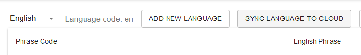

# Delete Language
This can remove languages from the localization used for both the web app and the USSD menu
1. Click the dropdown on the top left-hand side, then select the language to be deleted. \
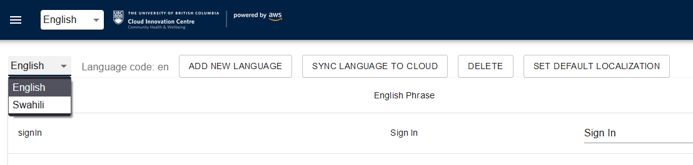
2. Click delete in the middle of the page to delete the language and sync to cloud, English cannot be deleted as it is the default.  \
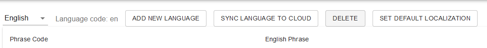

# Modify Localization
This can modify existing languages in the localization used for both the web app and the USSD menu
1. Click the dropdown on the top left-hand side, then select the language to be deleted. \

2. Edit Corresponding phrases to what you would like to change things to \
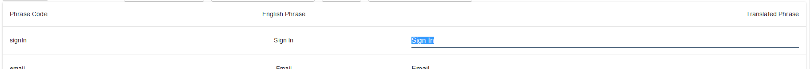
3. When you are done changing phrases, click **Sync Language to Cloud** in the top middle of the screen to save changes. \
