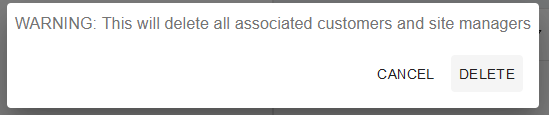

## Requirements

Before you deploy, you must have the following in place:
* [Web App Deployment](https://github.com/UBC-CIC/TapGives-Challenge/blob/master/docs/DeploymentGuide.md) 

| Index                                                           | Description                         |
|:----------------------------------------------------------------|:------------------------------------|
| [Part 1 - Account Registrations](#Part-1-Account-Registrations) | Account Registration                | 
| [Part 2 - Water Site](#Part-2-Water-Site-Operations)            | The technologies behind the project |

## Part 1 Account Registrations
| Index                                                  | Description                             |
|:-------------------------------------------------------|:----------------------------------------|
| [Admin Registration](#Register-TapGives-Admin-Account) | Demonstration of the website            | 
| [Site Manager Designation](#Designate-Site-Managers)   | The technologies behind the project     |

# Register TapGives Admin Account
By some technical restrictions of the development, TapGives Admins must be set on the AWS console.  Here, you'll learn how to register for an account on the web app, then how to set any accounts to TapGives Admin.
1. Enter Web App, press create an account 
2. Fill in account details
3. Check email, enter verification code 
4. Head to AWS online console, search for **Cognito**, and enter  
5. Select user pool corresponding to the project name (Default tapgiveschallenge) 
6. Click on user which you want to set to Admin 
7. Scroll down, and select **Add user to group** 
8. Select **Admins** and press **Add**  
9. Return to TapGives web app, and login.  Your user is now a TapGives Admin!  (If you are having issues, try relogging on the TapGives web app) 

# Designate Site Managers
We will assume that Site Managers have already created a web app account.  If this is not the case, refer to steps 1-3 in Part 1

1. Open the web app as a TapGives Admin account, and click the dropdown on the top left, click on Administration 
2. Select the user you want to designate as a Site Manager 
3. Select the sites you want them to manage 
4. Click **Update Site Managed** 
   The user is now a Site Manager, and their phone number should work for the USSD code, and their account should be able to access their designated water sites on the web app.

## Part 2 Water Site Operations
| Index                                         | Description                    |
|:----------------------------------------------|:-------------------------------|
| [Create Site](#Create-Water-Filtration-Sites) | Create a water filtration site | 
| [Modify Site](#Modify-Water-Filtration-Sites) | Modify water filtration site   |
| [Delete Site](#Delete-Water-Filtration-Sites) | Delete water filtration site   |

# Create Water Filtration Sites
1. Open the web app as a TapGives Admin account, and click the dropdown on the top left, click on Administration 
2. Click **Create New Site** 
3. Fill in the relevant details, then click **Create** in the bottom right 

# Modify Water Filtration Sites
1. Open the web app as a TapGives Admin account, and click the dropdown on the top left, click on Administration 
2. Select **one** water filtration site from the list 
3. Edit relevant details, then click **Edit Selected Sites** 

# Delete Water Filtration Sites
1. Open the web app as a TapGives Admin account, and click the dropdown on the top left, click on Administration 
2. Select as many water filtration sites from the list as you want to delete, then click **Delete Selected Sites** in the bottom right  
3. Press **Delete** again  

# Broadcast Message to all customers of a site
1. Open the web app as a TapGives Admin account, and click the dropdown on the top left, click on Administration 
2. Select as many water filtration sites from the list as you want to, then click **Broadcast Message** in the bottom right  
3. Enter in content to message, then press **Broadcast Message**  

## Part 3 Customer Search
| Index                                         | Description                    |
|:----------------------------------------------|:-------------------------------|
| [Create Site](#Create-Water-Filtration-Sites) | Create a water filtration site | 
| [Modify Site](#Modify-Water-Filtration-Sites) | Modify water filtration site   |
| [Delete Site](#Delete-Water-Filtration-Sites) | Delete water filtration site   |