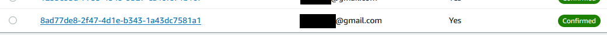
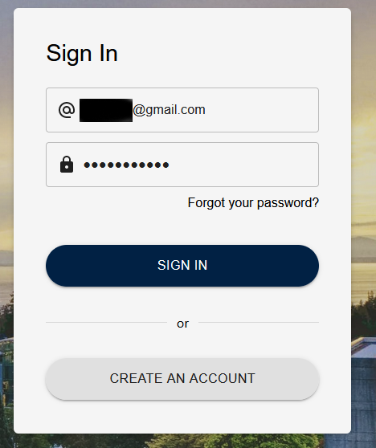
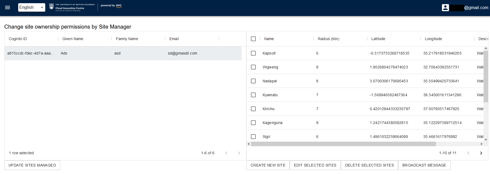
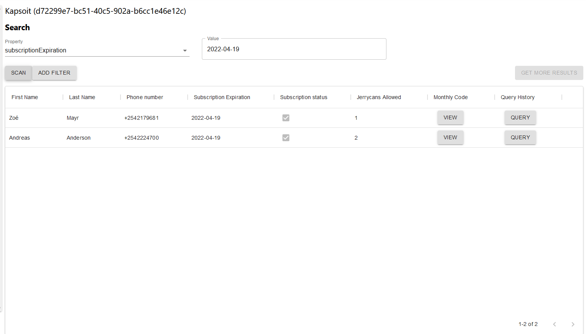

## Requirements

Before you deploy, you must have the following in place:
* [Web App Deployment](https://github.com/UBC-CIC/TapGives-Challenge/blob/master/docs/DeploymentGuide.md) 

| Index                                                           | Description                                   |
|:----------------------------------------------------------------|:----------------------------------------------|
| [Part 1 - Account Registrations](#Part-1-Account-Registrations) | Designating Site Managers and TapGives Admins | 
| [Part 2 - Water Site](#Part-2-Water-Site-Operations)            | Water Site Create/Read/Update                 | 
| [Part 3 - Customer Search](#Part-3-Customer-Search)             | Customer Search and Info                      |

## Part 1 Account Registrations
| Index                                                  | Description                             |
|:-------------------------------------------------------|:----------------------------------------|
| [Admin Registration](#Register-TapGives-Admin-Account) | Demonstration of the website            | 
| [Site Manager Designation](#Designate-Site-Managers)   | The technologies behind the project     |

# Register TapGives Admin Account
By some technical restrictions of the development, TapGives Admins must be set on the AWS console.  Here, you'll learn how to register for an account on the web app, then how to set any accounts to TapGives Admin.
1. Enter Web App, press create an account 
2. Fill in account details
3. Check email, enter verification code 
4. Head to AWS online console, search for **Cognito**, and enter  
5. Select user pool corresponding to the project name (Default tapgiveschallenge) 
6. Click on user which you want to set to Admin 
7. Scroll down, and select **Add user to group** 
8. Select **Admins** and press **Add**  
9. Return to TapGives web app, and login.  Your user is now a TapGives Admin!  (If you are having issues, try relogging on the TapGives web app) 

# Designate Site Managers
We will assume that Site Managers have already created a web app account.  If this is not the case, refer to steps 1-3 in Part 1

1. Open the web app as a TapGives Admin account, and click the dropdown on the top left, click on Administration 
2. Select the user you want to designate as a Site Manager 
3. Select the sites you want them to manage 
4. Click **Update Site Managed** 
   The user is now a Site Manager, and their phone number should work for the USSD code, and their account should be able to access their designated water sites on the web app.

## Part 2 Water Site Operations
| Index                                         | Description                    |
|:----------------------------------------------|:-------------------------------|
| [Create Site](#Create-Water-Filtration-Sites) | Create a water filtration site | 
| [Update Site](#Update-Water-Filtration-Sites) | Update water filtration site   |
| [Delete Site](#Delete-Water-Filtration-Sites) | Delete water filtration site   |
Open the web app as a TapGives Admin account, and click the dropdown on the top left, click on Administration 
# Create Water Filtration Sites
1. Click **Create New Site** 
2. Fill in the relevant details, then click **Create** in the bottom right 

# Update Water Filtration Sites
1. Select **one** water filtration site from the list 
2. Edit relevant details, then click **Edit Selected Sites** 

# Delete Water Filtration Sites
1. Select as many water filtration sites from the list as you want to delete, then click **Delete Selected Sites** in the bottom right  

# Broadcast Message to all customers of a site
1. Select as many water filtration sites from the list as you want to, then click **Broadcast Message** in the bottom right  
2. Enter in content to message, then press **Broadcast Message**  

## Part 3 Customer Search

# Search with filters
1. Click the dropdown at the top left, and click on Site Customers 
2. Select search property, and fill values exactly as they are shown in the table below 
3. If you'd like to have more filters, click press **Add Filter** and select any of the properties you want. 
4. When you're done, press **Scan**, and if not all the results are returned in one try, press **Get More Results** on the right-hand side

## Part 4 Localization
| Index                                             | Description                       |
|:--------------------------------------------------|:----------------------------------|
| [Default Localization](#Set-Default-Localization) | Set default languages             | 
| [Add New Language](#Add-new-Language)             | Add new language to localization  |
| [Delete Language](#Delete-Language)               | Delete language from localization |
| [Modify Localization](#Modify-Localization)       | Change localization phrases       |
Click the dropdown at the top left, and click on Site Customers 

# Set Default Localization
1. Click **Set Default Localization** on the right-hand side, and follow the menu.  This will overwrite any existing localization files and reset it to default if you have any.  

# Add new Language
1. Click **Add New Language** on the top left-hand side, then follow the menu.  The "Language code" should be an unique 2 letter short code for your language (eg. "en").  "Language Name" should be the language name (eg. "English").  
2. Click **Sync Language to Cloud** in the top middle of the screen. 

# Delete Language
1. Click on the dropdown on the top left-hand side, then select the language to be deleted. 
2. Click on delete in the middle of the page, English cannot be deleted as it is the default.  

# Modify Localization
1. Click on the dropdown on the top left-hand side, then select the language to be deleted. 
2. Edit Corresponding phrases to what you would like to change things to 
3. When you are done changing phrases, click **Sync Language to Cloud** in the top middle of the screen. 