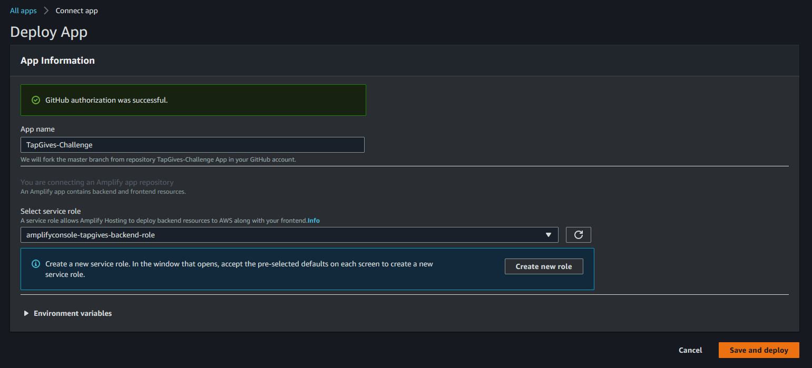

# Requirements
Before you deploy, you must have the following in place:
*  [AWS Account](https://aws.amazon.com/account/)
*  [GitHub Account](https://github.com/)
*  [AWS CLI](https://aws.amazon.com/cli/)
*  [AWS SAM](https://aws.amazon.com/serverless/sam/)

# Step 1: Front-end deployment
Before installing Amplify we need to create the IAM Role that associate the policies need to implement this solution. From the cloned directory, execute the follow CloudFormation template:

```bash
aws cloudformation deploy --template-file cfn-amplifyRole.yaml --stack-name amplifyconsole-tapgives-backend-role --capabilities CAPABILITY_NAMED_IAM
```
It creates the role name **amplifyconsole-tapgives-backend-role** that will be used on the next step.

The **Deploy to Amplify Console** button will take you to your AWS console to deploy the front-end solution.

<a href="https://console.aws.amazon.com/amplify/home#/deploy?repo=https://github.com/UBC-CIC/TapGives-Challenge">
    
</a>

1. 
2. Select the **amplifyconsole-tapgives-backend-role** for deployment
3. 